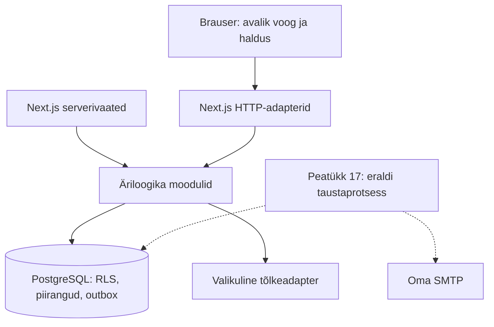

# Peatükk 14: tarkvara arhitektuur ja komponendid

Kohalik arhitektuur on modulaarne monoliit. Next.js teenindab veebivaateid ja HTTP-adaptereid; `src/lib` sisaldab ühist äriloogikat. PostgreSQL on tehingute, eralduse ja andmete allikas. Eraldi NestJS-i või Drizzle'i lisamine ei ole praeguse teostuse eeltingimus: jätkub ARCHITECTURE.md-s kirjeldatud Next.js + pg otsus. Seda erinevust lähteplaani tehnoloogiaettepanekust ei peideta.

## Moodulite vastutused

| Moodul | Teostus ja piir |
| --- | --- |
| Ettevõtted ja domeenid | `tenants`, `embed`, kontrollitud host ja ettevõtte domeeniseosed |
| Kasutajad ja õigused | `auth`, `access`, `invitations`, Better Auth + oma PostgreSQL; õiguste värske kontroll tehingus |
| Teenused ja sisutõlked | `service-management`, `service-translations`, `service-content`; tõlke pakkuja eraldi adapteris |
| Töötajad ja graafikud | `service-management`, `schedule-management`; ühine ettevõtte/töötaja lukustusprotokoll |
| Saadavus ja broneeringud | `availability`, `bookings`, `booking-management`, `booking-records`; lõplik kontroll ja outbox ühes tehingus |
| Kliendid | `customer-management`; õigustega päringud, parandused, audit ja piiratud CSV |
| Teavitused | `auth-mail` kontokirjade adapter; broneeringute outbox olemas, saatmistöötaja kuulub peatükki 17 |
| Keeled ja lepingud | `*-contracts`, `contracts`, `locales`, `i18n`; brauseriga jagatud tüübid/valideerimine, mitte andmebaasipäringud |
| Kujundus ja failid | `theme_configs`, `media` mudel olemas; failisalvestuse adapter ja töövoog tulevad vastava funktsiooni juures |
| Tellimused ja arved | Peatüki 13 skeem; teenusemoodul ja toimingud peatükis 19 |
| Import/eksport ja säilitamine | Skeem olemas; taustatööd ja elutsükkel peatükkides 18/21 |
| Audit ja platvormihaldus | `access.audit`, muutmatu audit, piiratud toeõiguste alus; täielik käitusvaade hiljem |

Moodulid on failipõhised, mitte eraldi võrguteenused. `src/lib` ei sõltu `src/app` ega `src/components` koodist. Serverivaade võib lugeda serverimoodulit otse; brauser kasutab avalikku või õigustega HTTP-liidest. HTTP-adapterid seovad hosti, autentimise, sisendi ja vastuse, ärireeglid jäävad teenusemoodulisse. Moodulitevahelised tehingulised abifunktsioonid võtavad sama `PoolClient` ühenduse; kõrvaline ühendus ei kuulu automaatselt olemasolevasse tehingusse.

## Täidetav arhitektuurikontroll

`npm run architecture:check` analüüsib TypeScripti impordigraafi. Kõik uued `src/lib` moodulid on vaikimisi serveri omad. Brauseriga jagatavad moodulid on skriptis selgelt lubatud nimekirjas; ka nende sõltuvused kontrollitakse. Kontroll järgib aliasi, suhtelisi importe, taasväljastusi ja sõnelise aadressiga dünaamilisi importe. Arvutatud moodulilaadimine on keelatud. Ainult tüübi import ei lisa käitusaegset sõltuvust.

Kontroll takistab serverimooduli sattumist kliendi sõltuvusahelasse ning teegi sõltuvust veebivaadetest. See käib automaatselt enne iga tootmise ehitust, ka Dockerfile'i builder-etapis. Negatiivsed testid tõendavad kaudse rikkumise tuvastamist. See on lähtekoodi piiride kontroll, mitte kogu kolmandate osapoolte koodi turvaaudit või brauserisse serialiseeritavate andmete kontroll.

## Käitus ja sõltuvused

Veeb töötab olemasoleva Dockerfile'i standalone-väljundiga mitte-root kasutajana. Migratsioonid käivad eraldi sihtmärgi ja andmebaasikontoga. PostgreSQL andmed vajavad püsiköidet; konteineri failisüsteem ei ole failide ega varukoopiate salvestuskoht. `/api/health` on ainult elusoleku signaal. SMTP, failisalvestuse ja töötaja valmisolekut ei järeldata sellest.

Otsesed npm-versioonid on täpsed, transitiivsed sõltuvused package-lock.json-is ning konteinerid digestiga. `npm ci`, `npm run licenses`, `npm run architecture:check`, `npm test`, `npm run typecheck` ja `npm run build` on omaniku keskkonnas käivitatavad. Sõltuvuste litsentsimärgised on [DEPENDENCIES.md](DEPENDENCIES.md); need ei asenda väljalaske litsentsiteadete kontrolli.

Põhibroneerimine ei vaja Verceli, hallatud autentimist/andmebaasi, Redis't, Kubernetes't ega tasulist kalendrit. Valikuline automaattõlge kasutab seadistamisel välist API-t; käsitsi tõlkimine ning põhivoog töötavad selleta. Broneeringukirjade tulevane töötaja peab kasutama sama versioonitud outbox'i, piiratud korduskatseid ja saatmiseelset seisundikontrolli. Selle käivitamine ning oma SMTP katse jäävad peatükki 17; siin ei lisata näilist töötajat, mis ülesandeid saatmata lõpetaks.

## Vastuvõtu piir

Kontrollitud 8. septembril 2026: 139 testi 17 failis läbisid (sh kolm arhitektuuri testi), tüübikontroll ja tootmise ehitus läbisid. Impordigraafis kontrolliti 74 lähtekoodifaili. Sõltuvuste register uuendati 194 lukufaili kirjega; `git diff --check` läbis.

Peatüki 14 kohalik arhitektuuri alus ja automaatne piiride kontroll on teostatud. Terviku tootmisvastuvõtt sõltub veel failidest, taustatöödest ja taristukatsest (17/18/21/22). Käesolev muudatus ei paigalda uut versiooni VPS-i. Järgmine peatükk on 15: broneerimismootor ja samaaegsus.
