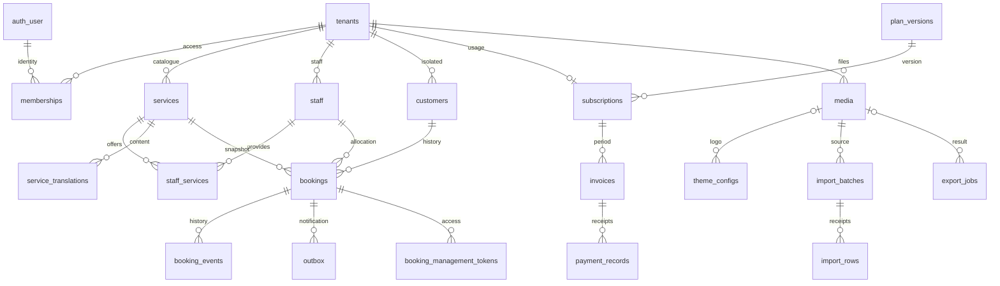

# Andmemudel ja lepingud

Peatüki 13 teostus, 08.09.2026. SQL-i lähteallikas on [versioonitud migratsioonid](../db/migrations); tegelikud väljatüübid, vaikeväärtused, piirangud, indeksid, päästikud, õigused ja RLS-poliitikad on genereeritud [SCHEMA.md](SCHEMA.md) aruandes. Aruannet uuendab `npm run db:schema`; see ei väljasta andmeridu ega ühenduse saladusi.

## Objektide vastendus

| Plaani objekt | Füüsiline kuju ja oluline seos | Kasutamise seis |
| --- | --- | --- |
| Tenant / TenantDomain | `tenants`, `tenant_domains`, `domain_reservations`, `tenant_embed_origins` | Töötav hosti- ja ettevõttekontekst. Domeeni reservatsioon jääb alles ka ettevõtte eemaldamisel. |
| User / Membership | `auth_user`, `auth_session`, `auth_account`, `auth_two_factor`, `memberships`, `invitations` | Globaalne sisselogija; roll ja töötajaseos on ettevõttepõhised. Avalik `staff` ei eelda kasutajakontot. |
| Location | `locations` lugemisvaade ettevõtte aadressist, ajavööndist ja reegliversioonist; `weekly_hours.staff_id IS NULL` on asukoha graafik | V1 üks asukoht ettevõtte kohta. `locations.id = tenant_id`; ei hoita teist lahknevat aadressi/graafikut. Mitme asukoha lisamine vajab eraldi migratsiooni ja pole V1 kasutajaliides. |
| Staff / StaffService | `staff`, `staff_services`, ühendvõtmed `(tenant_id, staff_id)` ja `(tenant_id, service_id)` | Iseseisvad hinna, kestuse ja puhvri erandid; NULL pärib vastava teenuse vaikeväärtuse. |
| ServiceGroup / Service | `service_groups`, `services`, `service_group_tree`; lisaks `service_translations` | Arhiveerimine, versioonid, lähtekeel ja eraldi sisuversioon. Kinnitatud tõlge peab vastama samale sisuversioonile. |
| Schedule / Exception | `weekly_hours`, `schedule_exceptions`, `schedule_versions` | Kohalik nädalapäev ja minutid, kuupäevaerandid; kattuvad vahemikud ja vigane JSON ei läbi andmebaasi. |
| Customer | `customers` ja `bookings.customer_id` | Ettevõttepõhine kaart. `name`/`customer_name` on teenuse saaja; `email`/`phone` võivad kuuluda kontaktisikule. Üksnes sama e-post ei ühenda inimesi. Eraldi kontaktisiku nime pole broneerimiseks nõutud ega automaatselt oletatud. |
| Booking | `bookings`, `booking_requests`, `booking_commands` | Teenuse/töötaja/kliendi hetktõmmis, raha, kestus, tingimused, allikas, keel, versioon, algus/lõpp ja korduskindlus. |
| BookingAllocation | `booking_allocations` lugemisvaade `bookings.occupied` väljast | V1 üks töötaja broneeringu kohta. Teenindusaeg ja hõivamine on eraldi väljad; eraldi vaade ei kopeeri ajavahemikku. `bookings_no_overlap` kaitseb sama kanoniseeritud hõivet. Hilisema ressursi või mitme jaotuse jaoks tuleb mudelit laiendada. |
| BookingEvent / AuditLog | `booking_events`, `access_audit_log` | Piiratud õigustega ajalugu, tegija, põhjus ja hetktõmmised. Rakendusrollil puudub muutmis-/kustutamisõigus. |
| BookingAccessToken | `booking_management_tokens` | Räsi, ettevõte/broneering, kehtivus, tühistamine; saladus ei ole avalik andmeväljavõte. |
| Notification / Outbox | `outbox` | Broneering, versioon, liik, keel, seisund; lisatud katsete arv, järgmine/eelmine katse, veakood, saatmisaeg ja kohaletoimetamise seisund. Saatmisprotsess on peatüki 17 töö. |
| ThemeConfig / Media | `theme_configs`, `media` | Skeemi alus: mustand ja avaldatud muutmatu versioon, kontrollitud faili viide, suurus, tüüp, räsi, seisund ja aegumine. Kujundus/UI ning failiüleslaadimine on jätkuvalt ootel. |
| Plan / Subscription | `plan_versions`, `subscriptions` | Skeemi alus: muutmatud paketiversioonid, sentides kuutasu ja valuuta, piirangud, periood, tasutud aeg ja kasutusõigus. Hinnakirja ei ole külvatud. |
| Invoice / PaymentRecord | `invoices`, `payment_records` | Skeemi alus: perioodi korduskindlus, arve hetkeseis, number/tähtaeg, laekumise tegija/aeg/summa; paranduseks pöördkirje ja uus kirje. Tegelik arveldus on peatüki 19 töö. |
| ImportBatch / ExportJob | `import_batches`, `import_rows`, `export_jobs` | Skeemi alus: vastendus, eelvaade, vead, kinnitaja, korduskindlad read, tulemuse fail ja aegumine. Impordi meeldetuletused vaikimisi keelatud. Suure ekspordi/importimise protsess on peatüki 18 töö. |
| Säilituskava | `retention_policies` | Andmeliigi kaupa tähtaeg/toiming/kinnitaja ja säilitamise peatamine. Vaikimisi pole heakskiidetud tähtaegu ega automaatset kustutamist. Tähtajad ja protsess kinnitatakse peatükis 21. |

Uute elutsüklitabelite rakendusrollil on praegu ainult SELECT. Tabelite olemasolu ei ava arve-, faili-, impordi- ega kustutamis-API-t. Nende kirjutusõigused lisatakse koos vastava peatüki autentitud töövoo ja vastuvõtutestidega.

## Seoste ülevaade

Kõik ettevõttepõhiste objektide omavahelised viited sisaldavad ettevõtte tunnust. Globaalne kasutaja ja paketiversioon pole ettevõtte kliendibaas; nende viited võivad teadlikult ületada ettevõtte konteksti. `domain_reservations.tenant_id` ei ole välisvõti, et vana domeeni omanikutunnus säiliks pärast ettevõtte eemaldamist.

## Invariandid

| Reegel | Andmebaasi ja rakenduse teostus |
| --- | --- |
| Ettevõttepiir | Ühendvälisvõtmed ning FORCE RLS. Uued lugemisvaated kasutavad `security_invoker`; asukohavaatel on lisaks konkreetse ettevõtte filter. Hosti, liikmesuse ja rolli kontroll jääb serverimoodulisse. |
| Teenindusaeg | `end_at = start_at + duration` minutites. Kestus 5–720 minutit. |
| Hõivamine | Poolavatud `[algus, lõpp)` vahemik algab täpselt ettevalmistuspuhvri võrra varem ja lõpeb lõpetamispuhvri võrra hiljem. Puhvrid 0–240 minutit. |
| Kattumine | Sama ettevõtte ja töötaja tühistamata hõivamised ei kattu. Teenindatuks või mitteilmunuks märkimine ei vabasta puhvrit. |
| Kohalik graafik | Nädalapäev 1–7, minutid 0–1440. Kõrvutised vahemikud on lubatud; kattuvad, murdarvulised, pööratud või piiridest väljas vahemikud pole lubatud. Ajavöönd peab leiduma PostgreSQL-i ajavööndiloendis. Olematu/mitmetähendusliku kohaliku aja pakkumise reegel jääb mootorisse. |
| Raha | Täisarv sentides; `currency = EUR`. Teenuse-/töötajaerand, broneering ja arveldus hoiavad raha ilma ujukomaarvuta. Arve `total = subtotal + tax`; kinnitamata maksureeglit pole väärtuseks oletatud. |
| Versioonid | Broneeringu, teenuse, töötaja, grupi ja seose versioon on positiivne. Graafiku puuduv algseis on 0. Tulevaste kriitiliste tabelite versiooniväli on olemas; kirjutus-API peab võrdlema oodatud versiooni ja suurendama seda. |
| Hetktõmmised | Broneeringu ajalooline nimi/hind/kestus ei sõltu teenuse praegusest reast. Paketiversioon ei muutu. Väljastatud arve sisu ei muutu; makse summat ei parandata üle kirjutades. |
| Tõlke avaldamine | Ainult kinnitatud sama algteksti versiooni tõlge on avalik. Hilinenud automaattõlge ei kirjuta uuemat teksti üle. |
| Import/eksport | Ettevõttepõhine kordustunnus, rea tunnus ja seotud objekti ühendvälisvõti. Ekspordil on lõppaeg ja valmimiseks kaitstud allalaadimistunnus/fail. Impordi käivitamine ja meeldetuletused vajavad eraldi kinnitajaandmeid. |
| Kustutamine | Puudub üldine kustutamis-API. Broneeringu-/arveldus-/auditiseoseid ei käsitleta ühe kaskaadkustutuse objektina. Säilitamise tähtaegu pole ärilise/õigusliku kinnituseta seadistatud. |

Vaadete õiguste alus: [PostgreSQLi security_invoker](https://www.postgresql.org/docs/17/sql-createview.html). Andmebaasi privileegid täiendavad serveri kasutajaõigusi; `booking_app` on ühine tehniline roll, mitte lõppkasutaja identiteet.

## API lepingud ja ühilduvus

| Olemasolev piir | Leping |
| --- | --- |
| Avalik kataloog | `Catalog`/`Service` failis [contracts.ts](../src/lib/contracts.ts). Avalik tõlkeobjekt sisaldab ainult kinnitatud jooksva sisuversiooni nime/kirjeldust, mitte mustandeid ega ajalugu. Ettevõte leitakse kontrollitud hostist. |
| Saadavus/kinnitus | `Offer`, `BookingInput`, `BookingResult`; hind sentides, ISO ajatemplid koos nihkega, reeglite versioon ja korduspäringu UUID. Hind, kestus ja saadavus kontrollitakse salvestamisel uuesti. |
| Teenuse haldus | [service-management-contracts.ts](../src/lib/service-management-contracts.ts): UUID seosed, sisendipiirid, oodatud versioon ja lähtekeel. Hinnamuutus ei suurenda eraldi sisuversiooni. |
| Tõlke haldus | [service-translation-contracts.ts](../src/lib/service-translation-contracts.ts): teenus, sihtkeel, oodatud tõlke- ja algteksti versioon; eraldi `save`, `publish`, `generate`. |
| Broneeringu haldus | [booking-management-contracts.ts](../src/lib/booking-management-contracts.ts): lubatud toimingud, versioon, erandi põhjus ja rollipiirang. Avalik haldamine vajab broneeringu kaitstud tunnust. |
| Kliendikaart | [customer-management.ts](../src/lib/customer-management.ts): täieliku algse hetktõmmise koondamine, eraldi auditeeritud parandus. Sama kontaktiga erinev teenuse saaja jääb eraldi. |
| Uued elutsüklitabelid | Avalikud ega kirjutavad API-d pole veel avatud. Nende tulevased käsud peavad sisaldama ettevõtet, kordustunnust ja vajaduse korral oodatud versiooni; faili allalaadimise õigust/aegumist kontrollitakse ka väljastamisel. Täpsed ärilised käsud kuuluvad peatükkidesse 18/19/21. |

Migratsioonid 014–016 on lisanduvad. Olemasolevaid broneeringuid, hindu, keeli ega inimesi ei nimetata ümber. Uued rangemad CHECK/EXCLUDE-piirangud valideerivad ka olemasolevad read; vigane olemasolev andmestik katkestab migratsiooni, seda ei parandata vaikides. Enne tootmise paigaldust tuleb järgida varukoopia ja migratsiooni käitamise korda.

## Säilitamise piirid

`customers.source_key` sisaldab algset nime ja kontakte ning on samuti isikuandmestik. Anonüümimise töövoog peab käsitlema lisaks kaardile broneeringu hetktõmmiseid, korduspäringu vastuseid, ajalugu ja ekspordifaile. Praegu ei ole anonüümimiskäsku; ei väideta, et ühe veeru tühjendamine eemaldab inimese kõik andmed.

Arve ja laekumise säilitamine on eraldi broneeringu kontaktidest. Failikirje `expires_at` ja ekspordi aegumine ei tähenda iseenesest füüsilise faili koristamist; koristaja ning õiguste korduskontroll lisatakse failide/ekspordi peatükis. Retentsioonipoliitika kinnitamiseks nõutakse tähtaega, toimingut, tegijat ja aega; puuduva kinnitusega automaatne kustutamine ei käivitu.
